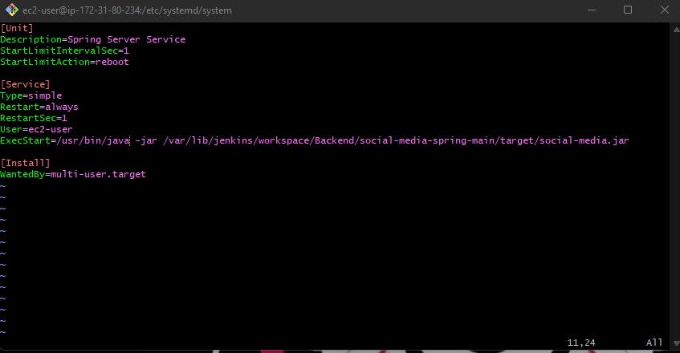
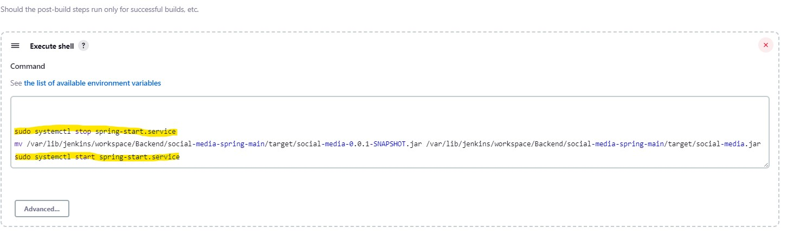

# Startup

The backend of this project can be run either locally or remotely.

<h3>To run locally:</h3>
<ol type="1">
  <li>Be sure the Java Runtime Environment (JRE) for Java 11 is installed.</li>
  <li>Run the <code>SocialMediaApplication.java</code> file in <code>social-media-spring-main/main/java/com/revature/</code>. This can be accomplished by:
    <ul>
      <li>Running <code>javac SocialMediaApplication.java</code> and then <code>java SocialMediaApplication.class</code> in the command line at the folder's location.</li>
      <li>Opening this project in Spring Tool Suite and running the project as a Spring Boot App.
    </ul>
  </li>
  <li>This will start the App and an embedded H2 database.
    <ul>
      <li>The App will be running on <a href="http://localhost:8081/">http://localhost:8081/</a>.</li>
      <li>The H2 database can be logged into at <a href="http://localhost:8081/h2-console/login.jsp">http://localhost:8081/h2-console/login.jsp</a> with:
        <dl>
          <dt>Driver Class:</dt>
          <dd>org.h2.Driver</dd>
          <dt>JDBC URL:</dt>
          <dd>jdbc:h2:mem:memdb</dd>
          <dt>User Name:</dt>
          <dd>sa</dd>
          <dt>Password:</dt>
          <dd>password</dd>
</ol>

<h3>To run remotely:</h3>
<ol type="1">
<li>Set up your Amazon EC2 Instance.
<li>Set up your Jenkins pipeline.
<li>Take note of where Jenkins places SpringBoot project's .jar file after the build completes.
<li>Create a simple systemd service that will tell the EC2 to run the .jar file.
<ul>
<li>Below is an example of the simple service you will need to create.

</ul>
<li>If you are still making changes to the code, you will need to incorporate the stopping and starting of this simple service into your Jenkins build.  This is done in post build actions.
  <ul>
  
  </ul>
<li>This will stop your application and then restart it with the new build.
<li>To access your application remotely once it is running on your EC2 using the simple service, go to your EC2's public address with whichever port your SpringBoot application is set up to run on. For example, port 8081.

